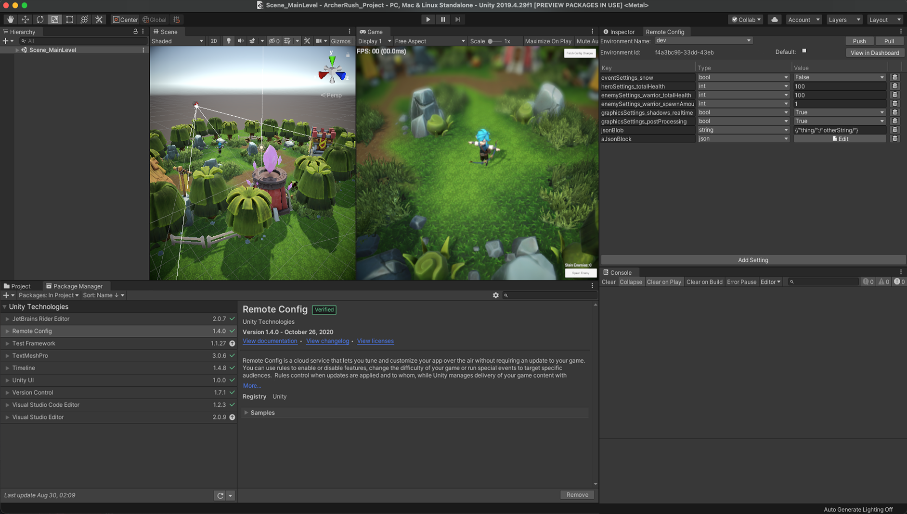

# Unity Remote Config

Unity Remote Config is a cloud service that allows you to tune your game design without deploying new versions of your application. With Remote Config, you can:

* Adapt your game to different types of players.
* Tune your game difficulty curve in near real time.
* Alter graphic quality based on device to optimize performance.
* Roll out new features gradually while monitoring impact.
* Tailor game settings to different regions or other player segments.
* Run campaign tests comparing colors, styles, prices, etc.
* Turn seasonal, holiday, or other time-sensitive events on or off.
* Enable or disable features for specific player segments or across the entire user base.

Create and Manage Environments to group Campaigns and Settings together in ways that support your development, and deployment workflow. Environments can also be structured to fit your application so that specific Campaigns and Settings are retrieved and updated only when needed, allowing for Campaigns and Settings Keys to be reused.

Define Campaigns that control which players receive what settings updates, and when. Unity manages the delivery and assignment of those settings with minimal impact to performance. No update to your application is necessary. When a player launches your game, Remote Config detects contextual attributes used as Campaign conditions, based on Unity, the application, the user, or custom criteria that you define. The service then returns customized settings for each player according to the Campaigns that apply to them. This allows different players using the same version of your game to have slightly different experiences. It also allows you to understand the impact each experience has on your business.

`Verified Package`
**Note**: This is an verified version of the Remote Config package. The service is under active development and subject to changes that may impact the service's stability. If you encounter any issues, or have any questions, please [contact us](mailto:remote-config@unity3d.com).
